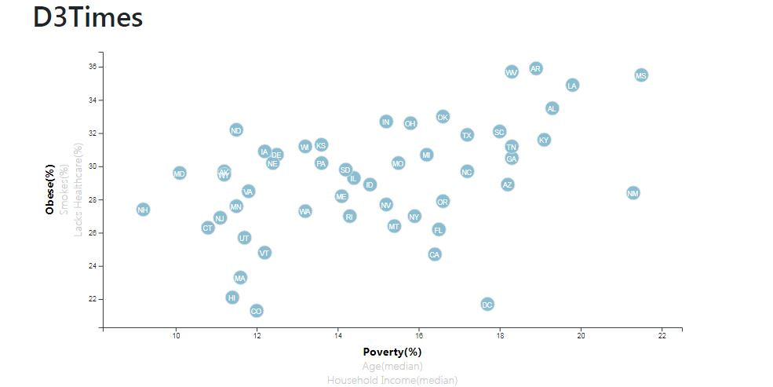

# D3-Data Journalism

<h3>Objective:</h3>
Using D3 techniques draw insights about the health risks facing particular demographics using the information from U.S. Census Bureau and the Behavioral Risk Factor Surveillance System. 
<h3>Overview:</h3>
A dynamic scatter plot created using D3.js. The scatter plot represents each state with circle element and compares the relationship between three health hazards obesity, smoking and lacking healthcare against the demographics poverty, age and household income.  

